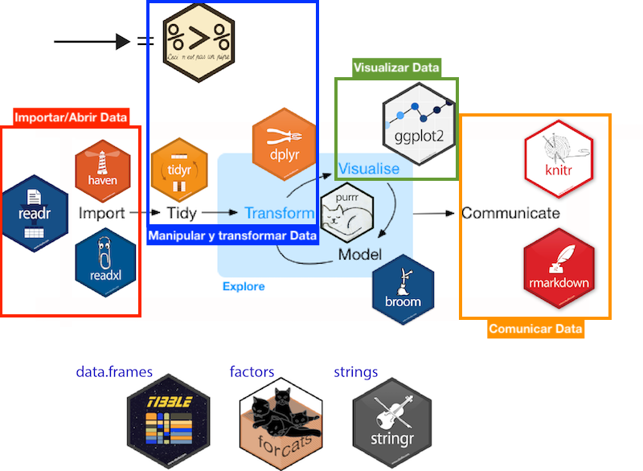
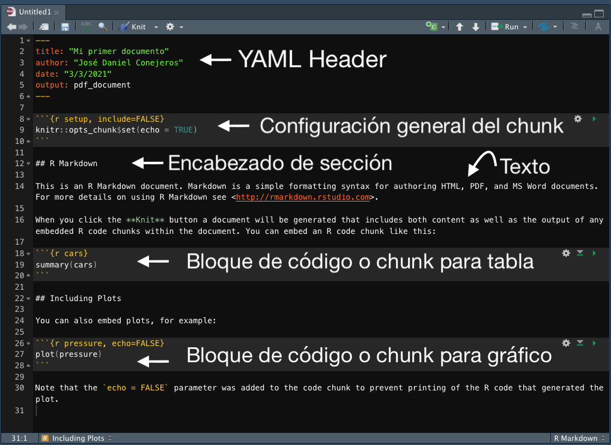
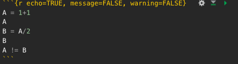
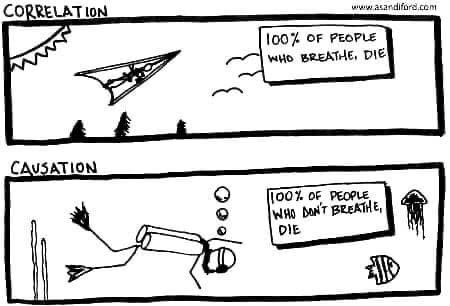

## Introducción

\vspace{0.3 cm}

`R` es un lenguaje de programación que proporciona un amplio abanico de herramientas para la computación estadística (modelos lineales, no lineales, test estadísticos, series de tiempo, algoritmos de clasificación y agrupación, ecuaciones estructurales, entre muchos otros^[Consulte aquí: https://www.r-project.org/]) y la visualización de datos^[Galeria de gráficos: https://www.r-graph-gallery.com/]. Además, `R` junto a su interfaz `RStudio` conforman un entorno de desarrollo integrado (IDE) que nos permite realizar múltiples tareas^[Consulte aquí: https://rstudio.com/products/rstudio/]: 

\vspace{0.2 cm}

```{r echo=FALSE, fig.align='center', fig.height=1, out.height="62.5%", out.width="62.5%"}

```

\vspace{0.2 cm}

En cursos anteriores se ha trabajado en importar, manipular, transformar y visualizar datos en `R`. Sin embargo, no importa lo bien que están hechos estos análisis si es que no pueden ser explicados de manera sencilla a otros.  Así, el objetivo de este documento es **comprender de manera práctica** los principales elementos para la reporteria de datos en `Rmarkdown`. En síntesis veremos los siguientes temas: 

+ `R`, `Markdown` y compiladores.
+ Flujo de trabajo en `Rmarkdown`.
+ Escritura: títulos, texto, numeración.
+ Ecuaciones y símbolos matemáticos.
+ Incrustar código: `chunks`.
+ Reporte de tablas, gráficos, imágenes. 
+ Bibliografía.

Antes de trabajar se debe tener instalados^[Puedes seguir otros tutoriales en: [tc.instructure.com](https://tc.instructure.com/courses/10621/pages/download-and-install-r-and-rstudio), [www.datacamp.com](https://www.datacamp.com/community/tutorials/installing-R-windows-mac-ubuntu?utm_source=adwords_ppc&utm_campaignid=1455363063&utm_adgroupid=65083631748&utm_device=c&utm_keyword=&utm_matchtype=b&utm_network=g&utm_adpostion=&utm_creative=332602034358&utm_targetid=aud-299261629574:dsa-429603003980&utm_loc_interest_ms=&utm_loc_physical_ms=1003325&gclid=Cj0KCQiA4feBBhC9ARIsABp_nbValrCAI62t7eiMO3Ac6sKti2qSX2Zw2VoPxfeL8NhyofRDLzVbHF0aAjYUEALw_wcB) o [www.dataquest.io](https://www.dataquest.io/blog/tutorial-getting-started-with-r-and-rstudio/). Cualquier duda contactar al correo jdconejeros@uc.cl]:

+ `R`. Sino lo tiene instalado puede revisar este tutorial: https://vimeo.com/203516510
+ `RStudio`. Sino lo tiene instalado puede revisar este tutorial: https://vimeo.com/203516968

## 1. `RMarkdown` y compiladores

\vspace{0.3 cm}

`Rmarkdown` es un ambiente para elaborar documentos interactivos con un código sencillo de utilizar. Esto lo hace un marco unificado para el desarrollo de análisis cuantitativos combinando texto, códigos y resultados en un solo espacio de trabajo. Estos documentos son completamente reproducibles y soportan variados formatos de salida. 

Los archivos de `Rmarkdown` o `.Rmd` están diseñados para usarse con el paquete de `rmarkdown` que viene instalado por defecto en `Rstudio`, sino lo tiene disponible puede instalarlo directamente: 

```{r eval=FALSE, echo=TRUE, message=FALSE, warning=FALSE}
install.packages("rmarkdown")
```

Además, cuando estamos produciendo documentos en PDF se requiere de un *compilador* de \LaTeX. En otras palabras, necesitamos un programa que tome el código del documento y genere una salida en PDF. Para esto se recomienda bastante descargar/instalar [MikTex](https://miktex.org/download) que cuenta con soporte para Windows, Mac y Linux^[No olvide revisar los requisitos computacionales: https://miktex.org/kb/prerequisites]. 

1. Ir a la web de [Miktex](https://miktex.org/) y descargar: https://miktex.org/download.
2. Ejecutar el instalador (apropiado según el sistema operativo de su computador).
3. Esperar que termine la descarga de los paquetes (esto tarda algunos minutos).
4. Una vez completado el instalador se debe reiniciar el equipo.

Una vez realizado estos pasos se puede comenzar a trabajar sin problemas. Los usuarios de Mac también tienen la opción de descargar/instalar [MacTex](http://www.tug.org/mactex/).  Además, es bastante recomendable trabajar en un `Rproject` ya que nos permite centralizar la ruta de trabajo con todos los insumos necesarios para el documento^[Puede consultar aquí: https://es.r4ds.hadley.nz/flujo-de-trabajo-proyectos.html]. 

## 2. Flujo de trabajo en `Rmarkdown`

\vspace{0.3 cm}

Los archivos con extensión `.Rmd` son el código fuente que tras ser "tejidos" y luego "compilados" se transforman en documentos enriquecidos y reproducibles. El primer paso de **tejer** (o `knitr`) permite ejecutar cada fragmento de código `R` que está en el documento (luego podra decidir si el código o el resultado serán visibles). 

La principal ventaja de estos documentos es su automatización. Por ejemplo, cuando se produce un gráfico o una tabla y luego aplicamos el clásico *copy-paste* sobre el reporte, vamos a estar realizando un procedimiento manual que tiene dos desventajas: (1) si los datos cambian, será necesario repetir todo el proceso para actualizar y (2) se pueden producir muchos errores involuntarios al *tipear* información. En cambio, gracias a esta herramienta, basta con solo actualizar el código-fuente, volver e tejer el documento y el insumo se actualizará con los cambios. 

```{r echo=FALSE, fig.align='center', fig.height=1, out.height="100%", out.width="100%"}

```

El segundo paso es **compilar/convertir** este documento a través de `pandoc` (un conversor). Esto nos permite transformar el código del archivo en un documento con distintos formatos. Por ejemplo podemos convertir nuestro archivo `.Rmd` en un archivo de salida HTML, PDF o Word e incluso en una presentación de diapositivas en HTML5 o PDF^[Una ventaja adicional es la posibilidad de incrustar código de fuente \LaTeX / `HTML` a nuestros documentos independiente el formato de salida. Esto hace más atractiva la posibilidad de agregar variados detalles al documento.]. Gracias a `Rstudio` podemos realizar estos dos pasos al mismo tiempo:

```{r echo=FALSE, fig.align='center', fig.height=1, out.height="55%", out.width="55%"}
knitr::include_graphics("image/f3.png")
```

\vspace{- 0.5 cm}

## 3. Escribir en `Rmarkdown`

\vspace{0.3 cm}

Para crear un informe de R Markdown podría:

+ Abrir un archivo de texto sin formato y guardar con la extensión `.Rmd` ó
+ Abrir un archivo de texto sin formato en su editor de scripts haciendo clic en:

  > `Archivo > Nuevo archivo > R Markdown`:

```{r echo=FALSE, fig.align='center', fig.height=1, out.height="55%", out.width="77%"}

```

En esta sección veremos cada uno de los elementos necesarios para la escritura de documentos:

### a. `YAML`

El `YAML Header` es el bloque del archivo `.Rmd` en donde se especifican todas las configuraciones del documento: nombre, autor(a/es/as), fecha y su formato: tamaño de la fuente (`fonsize`), el interlineado (`linestretch`), márgenes (`geometry`), resumen (`abstract`) y la salida (`output`). Se pueden agregar otras especificaciones al texto con la opción `header-includes`^[Puede complementar en el siguiente enlace: https://cran.r-project.org/web/packages/ymlthis/vignettes/yaml-fieldguide.html] que nos permite cargar paquetes desde \LaTeX, o también se puede utilizar un archivo `.css` para agregar configuraciones en lenguaje HTML.

\vspace{0.3 cm}

Veamos el `YAML` con las configuraciones por defecto: 

\vspace{0.3 cm}

```{r, eval=FALSE}
---
title: "Mi primer documento"     #Título del documento
author: "José Daniel Conejeros"  #Autor
date: "3/3/2021"                 #Fecha
output: pdf_document             #Salida
---
```

\break

Ahora veamos un `YAML` con especificaciones adicionales: 

\vspace{0.3 cm}

```{r, eval=FALSE}
---
title: "Mi primer documento"                        #Título del documento
author: "José Daniel Conejeros - jdconejeros@uc.cl" #Autor - Correo
date: '`r format(Sys.time(), "%d %B, %Y")`'         #Fecha automatizada
fontsize: 11pt                                      #Tamaño de la fuente 
linestretch: "1.0"                                  #Interlineado
geometry: margin=0.78in                             #Márgenes
output: pdf_document                                #Documento de salida
header-includes:                                    #Especificaciones en latex
   - \usepackage[spanish,es-tabla,es-nodecimaldot]{babel} #"Tabla" y "Figura" en español. 
   - \usepackage[utf8]{inputenc}                          #Codificación del texto
   - \usepackage{booktabs}                                # Formato de tablas
abstract: "Aquí pueden agregar un resumen de lo que van a escribir (opcional)." #Resumen 
---
```

\break

Ahora veamos un `YAML` más complejo: 

\vspace{0.3 cm}

```{r, eval=FALSE}
---
title: |
  | \vspace{-1cm} Herramientas para el reporte de datos en `RMarkdown` 
subtitle: | 
  | [Datos para la evaluación de impacto en políticas públicas](https://ep.ingenieriauc.cl/course/view.php?id=3285)
  | [Diplomado en Ciencia de Datos para Políticas Públicas](https://educacionprofesional.ing.uc.cl/?diplomado=diplomado-en-ciencia-de-datos-para-politicas-publicas)
date: |
  | \vspace{-0.5cm} `r Sys.setlocale("LC_TIME", "es_ES.UTF-8"); format(Sys.time(), "%d de %B, %Y")`
output:
  pdf_document: 
    fig_caption: yes
    latex_engine: xelatex
    keep_tex: false 
fontsize: 10pt
geometry: "left=2.2cm,right=2.2cm,top=2.5cm,bottom=2.5cm"
linkcolor: "blue"
header-includes:
  - \usepackage[spanish,es-tabla, es-nodecimaldot]{babel}
  - \usepackage[utf8]{inputenc}
  - \usepackage{leading}
  - \leading{13pt}
  - \usepackage[bottom]{footmisc}
  - \usepackage{multicol}
  - \usepackage{caption}
  - \usepackage{booktabs}
  - \usepackage{graphicx}
  - \usepackage{makecell}
  - \usepackage{fancyhdr}
  - \pagestyle{fancy}
  - \setlength\headheight{30pt}
  - \renewcommand{\headrulewidth}{0pt}
  - \fancypagestyle{plain}{\pagestyle{fancy}}
  - \fancyhead[L]{}
  - \fancyhead[R]{\includegraphics[width=5cm]{image/front.png}}
  - \usepackage{floatrow}
  - \floatsetup[figure]{capposition=top}
  - \floatsetup[table]{capposition=top}
  - \newcommand{\bcenter}{\begin{center}}
  - \newcommand{\ecenter}{\end{center}}
  - \newcommand{\btwocol}{\begin{multicols}{2}}
  - \newcommand{\etwocol}{\end{multicols}}
thanks: |
  | **Autores:** José Daniel Conejeros (jdconejeros@uc.cl) & 
  Pablo Celhay (pacelhay@uc.cl). 
abstract: "Aquí pueden agregar un resumen de lo que van a escribir (opcional)."
---
```

\break

### b. Encabezados, texto y listas

\vspace{0.3 cm}

**b1. Los encabezados parten con el signo # y tienen un orden jerárquico:**

\btwocol

`# Encabezado de primer nivel (Título grande)`


# Encabezado de primer nivel 

\etwocol

\btwocol

`## Encabezado de segundo nivel (Título mediano)`


## Encabezado de segundo nivel 

\etwocol

\btwocol

`### Encabezado de tercer nivel (Título pequeño)`


### Encabezado de tercer nivel 

(...) Puede seguir generando sub-encabezados. 

\etwocol

**b2. Formato al texto:** 

\vspace{0.3 cm}

+ `*cursiva*`   o `_cursiva_` para escribir en *cursiva*

+ `**negrita**` o `__negrita__` para escribir en **negrita**

+ `superíndice^2^`para agregar un superíndice^2^

+ `subíndice~2~` para agregar un subíndice~2~

+ Hipervínculos: `[Link a google](www.gogle.cl)`, se obtiene como salida: [Link a google](www.gogle.cl).

\vspace{0.3 cm}

**b3. Listas:** 

\vspace{0.3 cm}

Permite enumerar elementos en el texto.

\begin{multicols}{3}

Numeradas:

1. Para el primer ítem

2. Para el segundo ítem

3. Para el tercer ítem

Letras:

a. Para el primer elemento

b. Para el segundo elemento

c. Para el tercer elemento

Viñetas:

* Una viñeta cuadrada 

+ Una viñeta circular

- Una viñeta circular

\end{multicols}

\vspace{0.3 cm}

Por ejemplo:

\btwocol

```
1. Deportes:
  a. Fútbol:
    * 11 Jugadores 
  b. Tenis:
    * 2 a 4 Jugadores 

```

1. Deportes:
  a. Fútbol:
      * 11 Jugadores 
  b. Tenis:
      * 2 a 4 Jugadores 

\etwocol

\break

## 4. Expresiones matemáticas 

\vspace{0.3 cm}

Ecuaciones y otras expresiones matemáticas se pueden escribir utilizando el operador `$` al inicio y al final. Esto permite insetar estas expresiones en lenguaje latex de forma sencilla^[Puede consultar los simbolos matemáticos disponibles en:  https://oeis.org/wiki/List_of_LaTeX_mathematical_symbols o revisar: https://www.overleaf.com/learn/latex/List_of_Greek_letters_and_math_symbols]: 

\vspace{0.3 cm}

+ Un `$` permite agregar la expresión en el texto:

Escribir el promedio en `Rmarkdown`: `$\overline{x}={\frac {x_{1}+x_{2}+\cdots +x_{n}}{n}}$`

Da la siguiente salida: $\overline{x}={\frac {x_{1}+x_{2}+\cdots +x_{n}}{n}}$

\vspace{0.3 cm}

+ Dos `$$` permite agregar la expresión en un bloque visualizado:

Escribir la desviación estándar en `Rmarkdown`: 

    `$$s=\sqrt{\frac{1}{N-1} \sum_{i=1}^{n} (x_i-\bar{x})^2}$$`

Da la siguiente salida:

$$s=\sqrt{\frac{1}{N-1} \sum_{i=1}^{n} (x_i-\bar{x})^2}$$
\vspace{0.3 cm}

También se puede ejecutar código^[Puede consultar más detalles en el punto 2.5.3 de este bookdown: https://bookdown.org/yihui/rmarkdown/markdown-syntax.html o ver más expresiones en: https://en.wikibooks.org/wiki/LaTeX/Mathematics] de \LaTeX:

\vspace{0.3 cm}

```
$$X = \begin{bmatrix}1 & x_{1}\\
1 & x_{2}\\
1 & x_{3}
\end{bmatrix}$$
```

\vspace{0.3 cm}

Entrega la siguiente salida:

$$X = \begin{bmatrix}1 & x_{1}\\
1 & x_{2}\\
1 & x_{3}
\end{bmatrix}$$

\vspace{0.3 cm}

Por último, se pueden extraer ecuaciones matemáticas con la librería `equatiomatic`^[Más detalles en: https://datalorax.github.io/equatiomatic/articles/intro-equatiomatic.html#other-models-1].

\break 

## 5. Incrustar código: `chunk`

\vspace{0.3 cm}

Para ejecutar un código dentro del documento se necesita incrustar un **bloque** o `chunk`. Para esto hay tres caminos: 

1. Utilizar un atajo de teclado: `Cmd/Ctrl + option/Alt + I`.

2. Con el ícono `insert` en la barra de edición.

3. Tipeando de forma manual los delimitadores de bloque al inicio: ` ```{r} ` y al final: ` ``` `.

Por ejemplo, se puede explorar el siguiente `chunk`:

```{r echo=FALSE, fig.align='left', fig.height=1, out.height="50%", out.width="50%"}

```

Se obtiene la siguiente salida:

```{r echo=TRUE, message=FALSE, warning=FALSE}
A = 1+1
A
B = A/2
B
A != B
```

La salida de los bloques se pueden personalizar con las `options` que son argumentos suministrados en el encabezado del bloque. `Knitr` cuenta con alrededor de 60 opciones que se pueden utilizar para personalizar los bloques de código^[Puede revisar todas las opciones en el siguiente enlace: https://yihui.org/knitr/options/]. Los más utilizados controlan si el bloque es ejecutado y las especificaciones de la salida (en general son opciones lógicas aunque pueden variar en otras formas): 

+ `eval = FALSE` evita que el ccódigo sea evaluado. Si el código no es ejecutado, entonces no se generaran resultados. Esto es útil para mostrar códigos de ejemplo, o para deshabilitar un gran bloque de código sin comentar cada línea.

+ `include = FALSE` ejecuta un código, pero no lo muestra y tampoco presenta el resultado. Se usa para el código de configuración del reporte. 

+ `echo = FALSE` evita que se vea el código, pero si muestra los resultados en el reporte. 

+ `message = FALSE` o `warning = FALSE` evita que aparezcan mensajes o advertencias.

+ `results = 'hide'` oculta el output impreso; `results='asis'` el código creado por las funciones sea empleado en la compilación; `fig.show = 'hide'` oculta los gráficos.

Otro elemento muy útil es el **código en línea**, en otras palabras, se puede incrustar un resultado de `R` en un texto solo usando la expresión ``` `r ` ```. Esto evita errores de digitación y facilita la actualización rápida en las cifras de reportes. Por ejemplo: El resultado de 1+1 es  `` `r '\x60r 1+1\x60'` `` \rightarrow  \  **Salida:** El resultado de 1+1 es `r 1+1`. 

## 6. Reporte de tablas, gráficos e imágenes

\vspace{0.3 cm}

### a. Tablas 

\vspace{0.3 cm}

Hay varias maneras de construir tablas en `Rmarkdown` una de las más sencillas (pero menos automatizadas) es elaborar la tabla de forma manual en lenguaje `pandoc`: 

```

| País          | Gasto Social   | Votación por la izquierda |
|:-------------:|:--------------:|:-------------------------:|
| Inglaterra    | 16.0           | 20                        | 
| Alemania      | 29.7           | 37.0                      |       
| Portugal      | 21.6           | 34.4                      |
| Dinamarca     | 34.4           | 41.9                      |
| Chile         | 9.8            | 20                        |

```

Esto produce la siguiente salida:

| País          | Gasto Social   | Votación por la izquierda |
|:-------------:|:--------------:|:-------------------------:|
| Inglaterra    | 16.0           | 20                        | 
| Alemania      | 29.7           | 37.0                      |       
| Portugal      | 21.6           | 34.4                      |
| Dinamarca     | 34.4           | 41.9                      |
| Chile         | 9.8            | 20                        |

\vspace{-0.3 cm}

A pesar de que esto es sencillo, toma tiempo elaborar tablas con mucha información o especificaciones máss complejas. Además, es vulnerable a errores cuando los datos son actualizados. Dada estas limitaciones, hay dos librerías que facilitan la gestión y automatización de tablas^[Otras librerías: `xtable` (https://cran.r-project.org/web/packages/xtable/vignettes/xtableGallery.pdf), `stargazer` (https://cran.r-project.org/web/packages/stargazer/vignettes/stargazer.pdf), `pander` (http://rapporter.github.io/pander/), `DT` (https://rstudio.github.io/DT/),  `flextable` (https://davidgohel.github.io/flextable/), `gt` (https://gt.rstudio.com/), `huxtable` (https://github.com/hughjonesd/huxtable), etc.]: `kable` y `kableExtra`^[Todo el detalle de esta librería lo puede encontrar en: https://haozhu233.github.io/kableExtra/ para trabajar en pdf se recomienda revisar esta guía: https://haozhu233.github.io/kableExtra/awesome_table_in_pdf.pdf]. 

Un ejemplo: 

```{r echo=TRUE, message=FALSE, warning=FALSE}
#Crear una tabla con valores 
tabla <- data.frame(pais = c("Inglaterra", "Alemania", "Portugal", "Dinamarca", "Chile"), 
                   gto_social = c(16, 29.7, 21.6, 34.3,9.8),                        
                   votacion_izq = c(20, 37, 34.4, 41.9,20))    
#Ver la estructura de la tabla
str(tabla)
tabla #Esta tabla no es de calidad
```

```{r echo=TRUE, message=FALSE, warning=FALSE}
#Generar la tabla:
#install.packages("kableExtra")
library(kableExtra)
kable(tabla) # Generamos la tabla
```

Se puede mejorar esta tabla agregando una serie de argumentos (especificaciones a la función):

```{r echo=TRUE, message=FALSE, warning=FALSE}
#Tabla de calidad
#install.packages("dplyr")
library(dplyr) # Cargamos para usar el pipe (%>%) que encadena operaciones
kable(tabla, booktabs =TRUE,                  #Estilo de la tabla
      align = c("ccc"),                       #Alineación de columnas
      linesep = "",                           #Sin línea entre columnas
      caption = "Tabla de calidad",           #Título
      col.names =c("País", "Gasto Social (%)", 
                   "Votación de izquierda (%)")) %>% #Nombre de las columnas 
  kable_styling(latex_options =c("hold_position")
                , full_width = F) %>%         #Posición de tabla
  kableExtra::footnote(general = "Elaboración propia.", footnote_as_chunk = T, 
                       general_title="Fuente:", fixed_small_size=T) #Nota al pie de la tabla
```

Puede parecer un poco extenso el código, no obstante, en el mediano plazo esto es mejor por su reproducibilidad y su fácil edición. Ahora se va a representar el siguiente modelo de regresión OLS:
$$Gto\_Social = \beta_{0} + \beta_{1}* Vot\_Izquierda + \epsilon$$
```{r echo=TRUE, message=FALSE, warning=FALSE}
modelo <- lm(gto_social ~ votacion_izq, data=tabla) #Estimar
modelo #Ver la salida en R
```

Hay varios caminos para generar una tabla de calidad para modelos de regresión^[Puede ver otros caminos en: [https://stackoverflow.com](https://stackoverflow.com/questions/24342162/regression-tables-in-markdown-format-for-flexible-use-in-r-markdown-v2)]:

+ Librería `kable` + función `tidy` (de la librería `broom`):

```{r echo=TRUE, message=FALSE, warning=FALSE}
#install.packages("broom")
library(broom)
mod <- tidy(modelo)
mod$term <- c("Intercepto", "Votación por la Izquierda (%)")
kable(mod, booktabs =TRUE, digits=3, align = c("ccccc"), caption = "Modelo OLS para Gasto Social",       
      col.names=c(" ", "Beta", "Error estádar", "Valor t", "Valor p")) %>% 
  kable_styling(latex_options =c("hold_position"), full_width = F) %>%  
  kableExtra::footnote(general = "Elaboración propia.", footnote_as_chunk = T, 
                       general_title="Fuente:", fixed_small_size=T)
```


+ Libreria `texreg`^[Puede profundizar en: https://cran.r-project.org/web/packages/texreg/vignettes/texreg.pdf]

```{r echo=TRUE, message=FALSE, warning=FALSE, results='asis'}
#install.packages("kableExtra")
library(texreg) #Especificar en el chunk la opción {results='asis'} para visualizar.
texreg(l=list(modelo),                               #Modelo a utilizar 
       caption="Modelo OLS para Gasto Social",       #Título
       custom.coef.names=c("Intercepto","Votación por la Izquierda (%)"), #Nombre de variables
       float.pos="h" , digits = 3,                  #Posición y dígitos
       single.row = FALSE,                          #Sin línea de fila
       fsingle.row = T,
       caption.above = TRUE,                        #Título sobre la tabla
       include.ci = FALSE,                          #Mostrar el intervalo
       stars = c(0.01, 0.05, 0.1))                  #Mostrar el nivel de significancia
```

### b. Gráficos 

\vspace{0.3 cm}

Para insertar un gráfico se puede ocupar la librería `ggplot2` y realizar las siguientes especificaciones adicionales en el `chunk`:

+ `fig.align = 'center'`: Centrar la figura
+ `fig.cap   = 'Variables'`: Nombre de la figura
+ `out.height= "80%"`: Alto de la figura 
+ `out.width = "80%"`: Ancho de la figura

```{r echo=TRUE, message=FALSE, warning=FALSE, fig.align='center', fig.cap='Variables', out.height="80%", out.width="80%"}
#Gráfico en ggplot
#install.packages("ggplot2")
library(ggplot2)
g1 <- ggplot(tabla, aes(y=gto_social, x=votacion_izq)) +
  geom_smooth(method = "lm", colour="black", se=T, formula=y ~ x) +
  geom_point() +
  geom_text(aes(label=pais),hjust=0.5, vjust=-1.2, size=2.5) +
  labs(y = "Gasto Social (%)", x = "Votación por la Izquierda (%)", 
       title="", caption = "Fuente: Elaboración propia. N=4 observaciones") +
  theme_light() +
  theme(axis.text.y = element_text(size=8),
        axis.text.x = element_text(size=8))
g1                                       #Ver el gráfico
ggsave("graficos/graph1.png", plot = g1) #Guardar el gráfico
```

### c. Imágenes 

\vspace{0.3 cm}

Hay dos caminos sencillos para insertar imágenes:

+ Desde el lenguaje base de `Rmarkdown`:

\vspace{0.3 cm}

```

```
\vspace{0.3 cm}

Sin embargo, este camino depende bastante de las rutas de trabajo, por lo que no es muy recomendado ya que dificulta la replicación (produce errores en documentos complejos). Lo ideal es trabajar con un `Rproject` y las operaciones a continuación.  

\vspace{0.3 cm}

+ Función `include_graphics` del paquete `knitr`:

\vspace{0.3 cm}

```{r echo=TRUE, fig.align='center', fig.height=1, out.height="50%", out.width="50%"}

```

\vspace{0.3 cm}

Se pueden ajustar estos parámetros^[Para otros parámetros puede revisar: https://yihui.org/knitr/options/#plots] del `chunk`:

+ `fig.align  = 'center'`: Alineación de la figura en el centro.
+ `fig.height = 1`: Altura. 
+ `out.height = "50%"`: Proporción del alto de la salida.
+ `out.width  = "50%"`: Proporción del ancho de la salida.

\break 

## 7. Agregar Bibliografía

\vspace{0.3 cm}

Para el trabajo con referencias bibligráficas se requiere de un archivo de bibliografía usando la opción `bibliography` en los metadatos del `YAML`. Por ejemplo:

```{r, eval=FALSE}
---
title: "Mi primer documento"
author: "José Daniel Conejeros"
date: "3/3/2021"
output: pdf_document
bibliography: references.bib 
---
```
 

Un documento de extensión `.bib`^[Se puede usar otros archivos de extensión distintos al `.bib`, puede consultar en las referencias de este documento.] es un archivo de texto plano `BibTeX` que consta de entradas bibliográficas tales como:

```
@Manual{R-base,
  title = {R: A Language and Environment for Statistical
           Computing},
  author = {{R Core Team}},
  organization = {R Foundation for Statistical Computing},
  address = {Vienna, Austria},
  year = {2019},
  url = {https://www.R-project.org},
}
```

Se puede citar directamente en el documento utilizando el código `@key` donde el `key` es la primera línea de la entrada anterior: `@R-base`. Para dejar las citas entre paréntesis, utilice `[@R-base]`^[Puede profundizar en https://bookdown.org/yihui/bookdown/citations.html, https://bookdown.org/yihui/rmarkdown-cookbook/bibliography.html y https://rmarkdown.rstudio.com/authoring_bibliographies_and_citations.html]. 

\vspace{0.3 cm}

## Nota Final

\vspace{0.3 cm}

  > Es recomendable practicar cada una de las herramientas revisadas. La curva de aprendizaje es empinada al inicio, pero se pueden obtener muchos beneficios en el mediano plazo. Al igual que aprender un idioma, `R` y `RMarkdown` requieren de mucha practica, ensayo/error y paciencia. Suerte en esta hazaña de construir documentos en `RMarkdown`.
  


\break

## Referencias 

\vspace{0.3 cm}

Hay múltiples referencias, paquetes, herramientas y formas de hacer las cosas en `RMarkdown`. Para no intimidarse con tal magnitud de información puede acceder a las siguientes referencias:

- [R Markdown: The Definitive Guide](https://bookdown.org/yihui/rmarkdown/): Una referencia obligada para aprender `Rmarkdown` desarrollada por Yihui Xie, J. J. Allaire & Garrett Grolemund en el 2020. (Yihui Xie es uno de los impulsores de `Rmarkdown`).

- [R para Ciencia de Datos](https://es.r4ds.hadley.nz/): Libro base para el uso de `R`, aquí podrán ver que la plataforma de Rstudio no es solo para el análisis estadístico, sino que de procesamiento de datos y reporte.

- [Funciones de RMarkdown](https://yongfu.name/Rmd_ref/): Una referencia compacta de Yongfu Liao (2019). 

- [Conceptos básicos de RMarkdown](https://stats.idre.ucla.edu/stat/data/rmarkdown/rmarkdown_seminar_flat.html): Una referencia más detallada de Andy Lin de UCLA. 

- [Tutorial en RStudio](https://rmarkdown.rstudio.com/articles_intro.html#:~: text=To%20transform%20your%20markdown%20file,in%20the%20new%20file%20format): tutorial rápido con opciones básicas.

- [RMarkdown Cheat Sheets](https://rstudio.com/wp-content/uploads/2015/02/rmarkdown-cheatsheet.pdf): Recurso visual en **inglés**.

- [Guía de referencia RMarkdown](https://rstudio.com/wp-content/uploads/2015/03/rmarkdown-reference.pdf): Recurso visual en **inglés**.

- [Latex Cheat Sheets](https://wch.github.io/latexsheet/latexsheet.pdf): Recurso para tener una idea base de \LaTeX.

\vspace{0.3 cm}

## Foros 

\vspace{0.3 cm}

Para los que alguna vez fuimos nuevos en `Rmarkdown` sirve bastante ver las preguntas/respuestas de otras personas en las comunidades de `R` (¡son muy activas!). De hecho, casi todas nuestras preguntas ya fueron respondidas por personas en todo el mundo. No olvidar que la mayoría de estos foros están en inglés: 

- [RStudio Community](https://community.rstudio.com/)

- [Stackoverflow](https://stackoverflow.com/questions/tagged/r)


